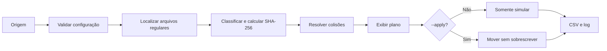

# Organizador Inteligente de Arquivos

> Automação em Python para analisar, classificar e organizar arquivos com segurança, rastreabilidade e controle total do usuário.

**Status:** MVP + vitrine React concluídos · **Versão:** 1.0.0 · **Python:** 3.12+ · **Frontend:** React 19 + TypeScript

O Organizador Inteligente transforma pastas desorganizadas em uma estrutura previsível por categorias. Ele primeiro cria um plano, mostra exatamente o que pretende fazer e gera uma auditoria. Os arquivos só são movidos quando a opção `--apply` é informada explicitamente.

## Por que este projeto existe

Pastas como Downloads e Documentos acumulam arquivos de vários formatos. A organização manual é repetitiva e pode causar perda de dados por sobrescrita ou exclusão acidental. Este projeto automatiza a tarefa sem abrir mão de quatro garantias:

- simulação é sempre o comportamento padrão;
- nenhum arquivo existente é sobrescrito;
- duplicados são apenas sinalizados, nunca excluídos;
- cada execução produz log e relatório CSV auditável.

## O que foi entregue

- CLI com modos de simulação e aplicação;
- regras externas em JSON, sem alterar o código;
- classificação por extensão sem diferenciar maiúsculas e minúsculas;
- categoria padrão para extensões desconhecidas ou ausentes;
- leitura não recursiva apenas de arquivos regulares;
- links simbólicos excluídos preventivamente da análise;
- hash SHA-256 calculado em blocos para detectar conteúdos idênticos;
- planejamento determinístico em ordem alfabética;
- colisões resolvidas com sufixos como `arquivo (1).pdf`;
- movimentação com criação exclusiva do destino, sem sobrescrita;
- isolamento de falhas: um arquivo com erro não interrompe os demais;
- destino validado para permanecer dentro da raiz configurada;
- log detalhado e CSV compatível com Excel e outras planilhas;
- códigos de saída próprios para sucesso, falha parcial e erro fatal;
- suíte automatizada cobrindo regras unitárias e fluxos integrados.
- vitrine React responsiva com análise local, filtros e exportação CSV;
- configuração JSON compartilhada entre a CLI Python e a demonstração web;
- integração contínua e publicação automatizada no GitHub Pages.

## Vitrine React

O diretório [`frontend`](frontend) contém uma experiência web minimalista para apresentar e demonstrar o produto. O visitante pode selecionar arquivos ou uma pasta, gerar hashes SHA-256, visualizar categorias e duplicados e exportar o plano em CSV. Todo o processamento ocorre no navegador: nenhum arquivo é enviado para servidor algum.

Por segurança e compatibilidade entre navegadores, a vitrine não move os arquivos selecionados. A aplicação real do plano continua sendo responsabilidade da CLI Python com `--apply`.

Para executar localmente:

```powershell
cd frontend
pnpm install
pnpm dev
```

Para validar e gerar a versão de produção:

```powershell
pnpm run check
```

## Fluxo seguro



O mesmo planejador alimenta os dois modos. Assim, a aplicação não executa uma regra diferente daquela apresentada na simulação.

## Começo rápido

### 1. Preparar o ambiente

No PowerShell:

```powershell
cd "caminho\para\Organizador_Inteligente"
python -m venv .venv
.\.venv\Scripts\Activate.ps1
python -m pip install --upgrade pip
python -m pip install -e .
```

No Linux ou macOS:

```bash
cd /caminho/para/Organizador_Inteligente
python3 -m venv .venv
source .venv/bin/activate
python -m pip install --upgrade pip
python -m pip install -e .
```

O projeto usa somente a biblioteca padrão durante a execução. O `setuptools` é usado apenas para instalar o pacote e disponibilizar o comando `organizer`.

### 2. Criar sua configuração

Use [`config.example.json`](config.example.json) como ponto de partida:

```powershell
Copy-Item config.example.json config.json
```

```json
{
  "destination_root": "./arquivos-organizados",
  "default_category": "Outros",
  "categories": {
    "Imagens": [".jpg", ".jpeg", ".png", ".gif", ".webp"],
    "Documentos": [".pdf", ".doc", ".docx", ".txt", ".md"],
    "Planilhas": [".csv", ".xls", ".xlsx"],
    "Compactados": [".zip", ".rar", ".7z"],
    "Código": [".py", ".js", ".ts", ".tsx", ".html", ".css", ".json"]
  }
}
```

Um `destination_root` relativo é resolvido a partir da pasta onde está o JSON. Assim, o resultado não muda quando o comando é executado a partir de outro diretório.

### 3. Simular primeiro

```powershell
organizer analyze --source "C:\Users\Daniel\Downloads" --config config.json
```

Também é possível executar sem o atalho instalado:

```powershell
python -m organizer.cli analyze --source "C:\Users\Daniel\Downloads" --config config.json
```

Exemplo de saída:

```text
PLANO DE ORGANIZACAO
----------------------------------------------------------------------------------------
[PLANNED  ] relatorio.pdf
  categoria: Documentos
  destino:   C:\projeto\arquivos-organizados\Documentos\relatorio.pdf
  detalhe:   Simulacao: nenhuma alteracao realizada.

RESUMO (SIMULACAO)
planejados: 1 | movidos: 0 | ignorados: 0 | duplicados: 0 | falhas: 0
```

A simulação não cria a árvore de destino nem altera a origem. Somente os artefatos de auditoria `.csv` e `.log` são gravados no diretório atual.

### 4. Aplicar o plano

Depois de revisar a simulação:

```powershell
organizer analyze --source "C:\Users\Daniel\Downloads" --config config.json --apply
```

Adicione `--verbose` para registrar mais informações de diagnóstico no log.

## Contrato da configuração

| Campo | Obrigatório | Regra |
| --- | --- | --- |
| `destination_root` | Sim | Texto não vazio; não pode ser igual à origem. |
| `default_category` | Não | Usa `Outros` quando ausente. Deve ser um único nome de pasta. |
| `categories` | Sim | Objeto em que cada chave é uma categoria e cada valor é uma lista. |
| Extensões | Sim, por regra | Devem começar com ponto e ser únicas, ignorando capitalização. |

Categorias não podem conter `/` ou `\`, nem ser `.` ou `..`. O destino é convertido para caminho absoluto antes de qualquer planejamento.

## Duplicados e colisões

Os arquivos são analisados em ordem alfabética estável. O primeiro conteúdo com determinado SHA-256 permanece `planned`; ocorrências seguintes com o mesmo hash recebem o estado `duplicate`, ficam na origem e aparecem no CSV com a referência do primeiro arquivo.

Duplicidade e colisão são conceitos diferentes:

| Situação | Comportamento |
| --- | --- |
| Mesmo conteúdo na origem | Sinaliza o segundo arquivo e não o move. |
| Mesmo nome já existente no destino | Propõe `nome (1).ext`, `nome (2).ext` e assim por diante. |
| Mesmo nome planejado na execução | Reserva nomes diferentes ainda durante a simulação. |
| Arquivo ilegível | Marca como `skipped`, registra a causa e continua. |
| Falha ao mover | Marca como `failed`, preserva a origem e continua os demais. |

O MVP não compara o conteúdo com arquivos que já estavam no destino. A detecção de duplicidade considera os arquivos encontrados na origem da execução atual.

## Relatórios e observabilidade

Cada comando `analyze` gera, no diretório em que foi iniciado:

```text
organizer-AAAAMMDDTHHMMSSffffffZ.csv
organizer-AAAAMMDDTHHMMSSffffffZ.log
```

O CSV é gravado em UTF-8 com BOM para facilitar a abertura no Excel e segue este contrato:

```text
timestamp,source,target,category,action,status,sha256,message
```

| Estado | Significado |
| --- | --- |
| `planned` | Movimento proposto; nenhuma alteração foi feita. |
| `moved` | Movimento concluído. |
| `skipped` | Arquivo ignorado por regra ou erro de leitura. |
| `duplicate` | Conteúdo idêntico a outro arquivo da mesma análise. |
| `failed` | O movimento falhou; os itens seguintes continuam. |

| Código de saída | Significado |
| --- | --- |
| `0` | Execução concluída sem falhas de movimentação. |
| `1` | Execução concluída, mas ao menos um movimento falhou. |
| `2` | Erro fatal de origem, configuração ou geração de artefato. |

## Arquitetura

```text
src/organizer/
├── cli.py          # contrato da linha de comando e orquestração
├── config.py       # leitura e validação do JSON
├── scanner.py      # descoberta não recursiva de arquivos
├── classifier.py   # categoria por extensão
├── duplicates.py   # SHA-256 em streaming
├── planner.py      # plano, confinamento e colisões
├── executor.py     # aplicação sem sobrescrita
├── reports.py      # terminal, logging e CSV
└── models.py       # contratos de dados tipados
```

As responsabilidades são separadas para permitir testar o planejamento sem tocar no destino e adicionar regras futuras sem acoplar a CLI.

## Estrutura do repositório

```text
Organizador_Inteligente/
├── .github/workflows/
├── frontend/
├── src/organizer/
├── tests/
├── .gitignore
├── config.example.json
├── LICENSE
├── pyproject.toml
└── README.md
```

## Testes

Execute toda a suíte com a biblioteca padrão:

```powershell
python -m unittest discover -s tests -t . -v
```

Valide o frontend:

```powershell
cd frontend
pnpm run check
```

A cobertura funcional inclui:

- extensões conhecidas, desconhecidas e com letras maiúsculas;
- configuração inválida e tentativas de caminho inseguro;
- hashes iguais e diferentes;
- nomes numerados em caso de colisão;
- simulação sem alteração da origem ou criação do destino;
- aplicação, duplicidade e preservação de arquivo preexistente;
- continuidade depois de uma falha individual;
- contrato das colunas do CSV;
- fluxo completo da CLI nos modos de simulação e aplicação.

## Decisões técnicas

| Decisão | Escolha | Motivo |
| --- | --- | --- |
| Linguagem | Python 3.12+ | APIs modernas, legibilidade e aderência à automação. |
| CLI | `argparse` | Nativo, previsível e testável. |
| Configuração | JSON | Editável e suportado pela biblioteca padrão. |
| Identidade de conteúdo | SHA-256 | Baixo risco de colisão e processamento em streaming. |
| Movimento seguro | Cópia exclusiva + remoção da origem | Impede sobrescrita inclusive entre volumes. |
| Auditoria | `logging` + CSV | Diagnóstico técnico e consulta amigável em planilhas. |
| Testes | `unittest` | Nenhuma dependência adicional. |
| Interface | React + TypeScript | Demonstração interativa, tipada e componentizada. |
| Build web | Vite | Desenvolvimento rápido e artefatos estáticos enxutos. |
| Publicação | GitHub Actions + Pages | CI e vitrine pública reproduzíveis. |

## Segurança por projeto

- `--apply` é a única forma de autorizar mudanças nos arquivos;
- nenhum fluxo exclui automaticamente arquivos duplicados;
- o destino final é verificado contra `destination_root`;
- categorias não podem injetar caminhos relativos ou absolutos;
- links simbólicos não entram no plano;
- a criação exclusiva (`xb`) impede substituir um destino existente;
- uma cópia incompleta é removida enquanto a origem permanece preservada;
- diretórios de categoria só são criados no modo de aplicação.

> **Importante:** mover um arquivo remove sua entrada da pasta de origem depois que a cópia e os metadados foram concluídos. Sempre revise a simulação e mantenha backup de dados importantes.

## Requisitos do MVP

- [x] Origem recebida pela CLI
- [x] Regras carregadas de JSON
- [x] Análise somente de arquivos regulares no nível raiz
- [x] Classificação de extensão sem diferenciar capitalização
- [x] Fallback para `Outros`
- [x] Plano exibido no terminal
- [x] Simulação como padrão
- [x] Aplicação somente com `--apply`
- [x] Criação de categorias apenas durante a aplicação
- [x] Proteção contra sobrescrita
- [x] Detecção de duplicados por SHA-256
- [x] Log e CSV por execução
- [x] Falhas fatais com código diferente de zero
- [x] Testes automatizados das regras críticas

## Limites atuais

Esta versão não percorre subpastas, não lê conteúdo semanticamente, não monitora diretórios em segundo plano, não sincroniza com nuvem e não oferece interface gráfica. Ela também não exclui duplicados nem desfaz automaticamente uma execução.

## Roadmap

- [ ] regras por palavras-chave no nome;
- [ ] organização por ano e mês;
- [ ] perfis como `downloads`, `faculdade` e `trabalho`;
- [ ] opção recursiva com limites explícitos;
- [ ] reversão auditada a partir do CSV;
- [ ] monitoramento opcional de pasta;
- [ ] interface gráfica com Tkinter;
- [ ] classificação semântica local e opcional.

## Texto para portfólio

> Desenvolvimento de automação em Python para análise e organização segura de arquivos, com classificação configurável, detecção de duplicados por SHA-256, modo de simulação, prevenção de sobrescrita, logs e relatórios CSV.

## Licença

Distribuído sob a licença MIT. Consulte [`LICENSE`](LICENSE).
